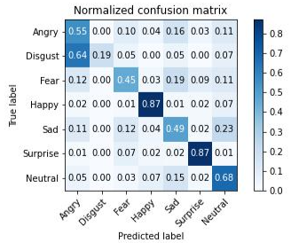
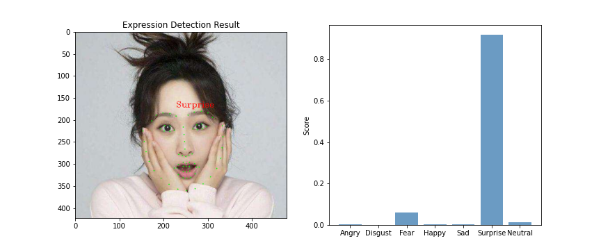

# CNN Facial Expression Classification
Facial Expression Rcognition(FER) based on deep convolutional neural network(CNN).

## Dataset
FER2013   [Challenges in Representation Learning: Facial Expression Recognition Challenge](https://www.kaggle.com/c/challenges-in-representation-learning-facial-expression-recognition-challenge)  
Download `icml_face_data.csv` and put it into `./data`
## Model
Based on VGG16, with GaussianNoise, and simpler fully-connected layers in the top. 
```python
# input  
input = Input(shape=(img_size, img_size, 1))

x = layers.BatchNormalization()(input)
x = layers.GaussianNoise(0.01)(x)

# 1st Conv Block
x = Conv2D(filters=64, kernel_size=3, padding='same', activation='relu')(x)
x = Conv2D(filters=64, kernel_size=3, padding='same', activation='relu')(x)
x = MaxPool2D(pool_size=2, strides=2, padding='same')(x)

# 2nd Conv Block
x = Conv2D(filters=128, kernel_size=3, padding='same', activation='relu')(x)
x = Conv2D(filters=128, kernel_size=3, padding='same', activation='relu')(x)
x = MaxPool2D(pool_size=2, strides=2, padding='same')(x)

# 3rd Conv block  
x = Conv2D(filters=256, kernel_size=3, padding='same', activation='relu')(x) 
x = Conv2D(filters=256, kernel_size=3, padding='same', activation='relu')(x) 
x = Conv2D(filters=256, kernel_size=3, padding='same', activation='relu')(x) 
x = MaxPool2D(pool_size=2, strides=2, padding='same')(x)

# 4th Conv block
x = Conv2D(filters=512, kernel_size=3, padding='same', activation='relu')(x)
x = Conv2D(filters=512, kernel_size=3, padding='same', activation='relu')(x)
x = Conv2D(filters=512, kernel_size=3, padding='same', activation='relu')(x)
x = MaxPool2D(pool_size=2, strides=2, padding='same')(x)

# 5th Conv block
x = Conv2D(filters=512, kernel_size=3, padding='same', activation='relu')(x)
x = Conv2D(filters=512, kernel_size=3, padding='same', activation='relu')(x)
x = Conv2D(filters=512, kernel_size=3, padding='same', activation='relu')(x)
x = MaxPool2D(pool_size=3, strides=3, padding='same')(x)

# Fully connected layers
flatten = Flatten()(x)
fc = Dense(units=2048, 
            activation='relu', 
            kernel_regularizer=l2(0.001), 
            bias_regularizer=l2(0.001)
            )(flatten)
fc = Dropout(dropout_rate)(fc)
fc = Dense(units=2048, 
            activation='relu',
            kernel_regularizer=l2(0.001),
            bias_regularizer=l2(0.001),
            )(fc)
fc = Dropout(dropout_rate)(fc)
output = Dense(class_num, activation="softmax")(fc)

# creating the model
model = Model(inputs=input, outputs=output)

optimizer = Adam(learning_rate)
model.compile(optimizer=optimizer, 
                loss=keras.losses.categorical_crossentropy, 
                metrics=['categorical_accuracy'])

return model
```
## Preprocessing
Usage: `python preprocess.py`  
Origin csv file is converted to images.  
Facial part of the image is detected and extracted by Dlib and Opencv2.
Then resize to original size(48*48).  
Several pickle files contain each image path and label.
```python
def crop_face_area(detector, landmark_predictor, image, img_size):
    p_img = Image.fromarray(image).convert(mode='RGB')
    cv_img = cv2.cvtColor(np.asarray(p_img), cv2.COLOR_RGB2GRAY)
    faces = detector(cv_img, 1)
    all_landmarks = []
    all_faces = []
    if len(faces) > 0:
        for face in faces:
            shape = landmark_predictor(cv_img, face)
            landmarks = np.ndarray(shape=[68, 2])
            for i in range(68):
                landmarks[i] = (shape.part(i).x, shape.part(i).y)
            all_landmarks.append(landmarks)
            x1, y1, x2, y2 = face.left(), face.top(), face.right(), face.bottom()
            if x1 < 0:
                x1 = 0
            if x1 > cv_img.shape[1]:
                x1 = cv_img.shape[1]
            if x2 < 0:
                x2 = 0
            if x2 > cv_img.shape[1]:
                x2 = cv_img.shape[1]
            if y1 < 0:
                y1 = 0
            if y1 > cv_img.shape[0]:
                y1 = cv_img.shape[0]
            if y2 < 0:
                y2 = 0
            if y2 > cv_img.shape[0]:
                y2 = cv_img.shape[0]
            img = cv2.resize(cv_img[y1:y2, x1:x2], (img_size, img_size))
            all_faces.append(img)
        return np.asarray(all_faces), np.asarray(all_landmarks)
    else:
        return None, None
```
After running the script, you should get the following files.
`shape_predictor_68_face_landmarks.dat` is downloaded from [davisking/dlib-models
](https://github.com/davisking/dlib-models)
```
│  icml_face_data.csv
│  shape_predictor_68_face_landmarks.dat
│  test.pickle
│  test_landmark.npz
│  train.pickle
│  train_landmark.npz
│  valid.pickle
│  valid_landmark.npz
│  __init__.py
├─test
├─train
| ├─0
| ├─1
| ├─2
| ├─3
| ├─4
| ├─5
| └─6
└─valid
  ├─0
  ├─1
  ├─2
  ├─3
  ├─4
  ├─5
  └─6
```
## Image Augmentation
```python
train_datagen = ImageDataGenerator(
    samplewise_center=True,
    samplewise_std_normalization=True,
    brightness_range=(0.8, 1.2),
    rotation_range=10,
    width_shift_range=0.1,
    height_shift_range=0.1,
    zoom_range=0.1,
    horizontal_flip=True,
)
```

## Training
Training and validation is performed on FER2013's Train and PrivateTest samples.  

* LR: 1e-4
* Batch size: 128
* Optimizer: Adam
* Dropout rate: 0.5
* Early stopping: monitor on validation loss with patience 6
* Learning rate reduce: factor 0.1 with patience 4  

Usage:
```
python train.py -h

usage: train.py [-h] [-dropout DROPOUT_RATE] [-lr LEARNING_RATE]
                [-batch_size BATCH_SIZE] [-model MODEL_NAME]

optional arguments:
  -h, --help            show this help message and exit
  -dropout DROPOUT_RATE, --dropout_rate DROPOUT_RATE
                        The dropout rate for the last dense layers.Default
                        0.5.
  -lr LEARNING_RATE, --learning_rate LEARNING_RATE
                        Learning rate. Default 1e-3.
  -batch_size BATCH_SIZE, --batch_size BATCH_SIZE
                        Batch size. Default 128.
  -model MODEL_NAME, --model_name MODEL_NAME
                        The classification model. Default vgg16.
```


## Testing
Test the performance on FER2013's PublicTest samples.
* Test-time augmentation: 10

Usage
```
python test.py -h

usage: test.py [-h] [-tta TTA] [-batch_size BATCH_SIZE] [-model MODEL_NAME]

optional arguments:
  -h, --help            show this help message and exit
  -tta TTA, --tta TTA   Test-time augmentation times. Default 5.
  -batch_size BATCH_SIZE, --batch_size BATCH_SIZE
                        Batch size. Default 128.
  -model MODEL_NAME, --model_name MODEL_NAME
                        The classification model. Default vgg16.
```
## Test on camera or images
Usage:
```
python detect.py -h

usage: detect.py [-h] [-tta TTA] [-model MODEL_NAME] [-cam CAMERA]
                 [-path IMAGE_PATH]

optional arguments:
  -h, --help            show this help message and exit
  -tta TTA, --tta TTA   Test-time augmentation times. Default 5.
  -model MODEL_NAME, --model_name MODEL_NAME
                        The classification model. Default vgg16.
  -cam CAMERA, --camera CAMERA
                        Whether to detect face using camera. Default False
  -path IMAGE_PATH, --image_path IMAGE_PATH
                        The path of the image. Only useful when -cam=false.
```

## Result

```
f1 score: 0.6575245688429467, acc: 0.6682750301568154, recall: 0.6682750301568154
```

## Example





## Environment
* python 3.9.7
* tensorflow 2.8.0
* keras 2.8.0
* dlib 
* opencv
